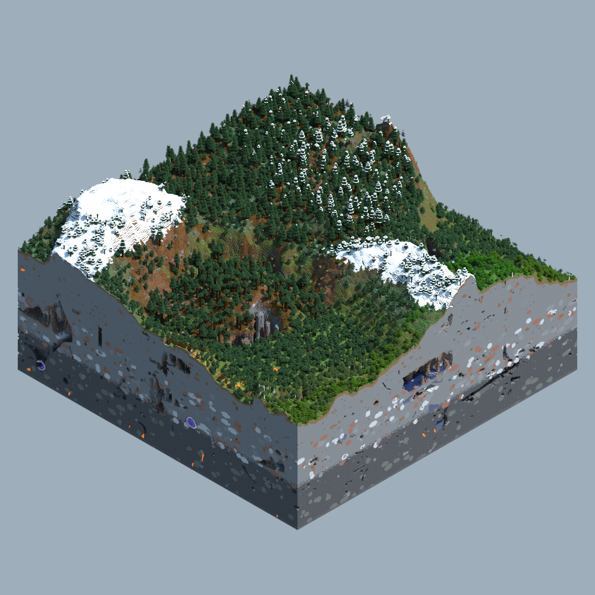

<div align="center">
    <h1>Minecraft NFT Region Generator</h1>
    
    
    
</div>

##

### Prerequisite

-   [Chunky](https://chunky-dev.github.io/docs/) launch installed.
-   A minecraft world with loaded chunks.

### Usage

```js
import { createGenerator } from 'chunky-region-generator'

const generator = createGenerator({}) // configs

for (let i = 1; i <= 100; i++) {
	await generator.generateImage(i) // generate images for 100 regions
}
```

### Configs

| Option                         | Description                                             |   Default   |
| ------------------------------ | :------------------------------------------------------ | :---------: |
| `chunkyHome`                   | The path that points to the Chunky home directory       |             |
| `chunkyLauncher`               | The path of the Chunky launch jar file                  |             |
| `outputPath`                   | Output file for the generated content                   | `Downloads` |
| `sceneName`                    | The scene of the name to render from                    |   `scene`   |
| `mcVersion`                    | The Minecraft version (used for Biomes)                 |  `1.18.2`   |
| `resgionSize`                  | The size of a region in chunks (eg. 8 will be 8x8)      |             |
| `totalCount`                   | The total amount of regions to render                   |             |
| `notifyWhenDone`               | Whether to log Chunky's output                          |   `false`   |
| `metadataOptions.description`  | The Nft project's description.                          |             |
| `metadataOptions.external_url` | Any external url for the Nft's project,                 |             |
| `metadataOptions.image_url`    | The external URL where the images are uploaded          |             |
| `metadataOptions.namingScheme` | The naming scheme to follow (replaces '%' with number ) |             |
